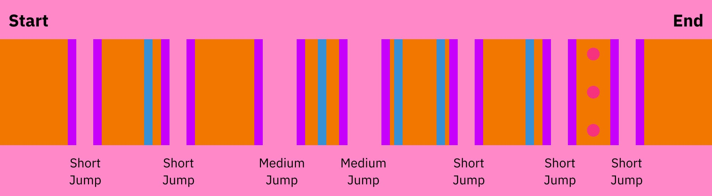

# 5 벽

## 주황색 롤

이 패턴은 모든 패턴 중 총 5개의 벽으로 가장 많은 벽을 가지고 있기 때문에 붙여진 이름입니다.

### 기억해야 할 사항

* **이 패턴에 있는 5개의 벽은 여유 공간이 거의 없습니다.** 벽 점프를 어렵지 않게 수행할 수 있거나 다른 플레이어와의 충돌을 피하고자 벽 점프를 시도하지 않는 이상 가급적 파란색에 머무를 수 있도록 노력하세요.
