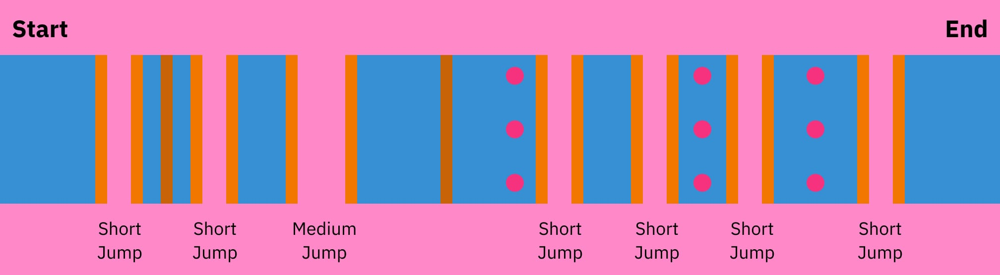

# 이지 4

"이지 4" 패턴은 4번의 짧은 점프가 연속적으로 이어진다는 점에서 붙여진 이름입니다.

이 패턴은 주황색과 파란색 롤이 서로 반전만 되어있을 뿐 모두 동일한 패턴입니다.

## 주황색 롤

주황색 "이지 4" 패턴은 시작부터 4번 연속으로 짧게 점프할 수 있어 붙여진 이름입니다.

### 기억해야 할 사항

* **4번의 짧은 점프로 시작합니다.** 이 공간을 활용하기 위해 주황색에서 시작하는 것이 좋습니다.
* **벽으로 끝납니다.** 특히 롤 오프 후반에 한 바퀴가 끝날 때 파란색에서 주황색으로 전환하는 것이 까다로울 수 있습니다.

## 파란색 롤

파란색 "이지 4" 패턴은 마지막에 4번 연속으로 짧게 점프할 수 있어 붙여진 이름입니다.

### 기억해야 할 사항

* **벽과 함께 시작됩니다.** 이 벽에 바로 부딪히지 않도록 주황색에서 시작하는 것이 좋습니다.
* **4번의 짧은 점프로 끝납니다.** 이 공간을 활용하기 위해 파란색에서 끝나는 것이 좋습니다.
