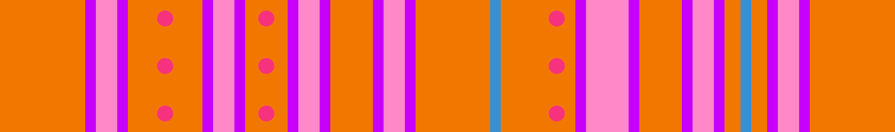
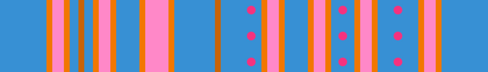

# Easy 4

There are two Easy 4 rolls, one that is orange and another that is blue. Both of the rolls are identical, aside from the fact that they are mirror images of each other.

## Orange

This variation gets its name for having 4 easy, straightforward jumps at the beginning. It's a flipped variation of the blue Easy 4, and has the beginning blue ends off with. This is by far considered the easiest orange variant to traverse on due to how small the gaps are and how spacious it is. There is not a single gap you need to worry about diving on, and each jump can be made relatively easily.

At the beginning, there are 4 consecutive jumps you can make, then after this there is a wall, with 3 platforms surrounding another wall that has 2 small gaps.

## Blue

This variation gets its name for having 4 easy, straightforward jumps at the end. It's a flipped variation of the orange Easy 4, and has the ending orange starts off with. This is by far considered the easiest blue variant to traverse on due to how small the gaps are and how spacious it is. There is not a single gap you need to worry about diving on, and each jump can be made relatively easily.

At the beginning, there is a small gap that leads into a wall, with 3 platforms surrounding another wall that has 2 small gaps, then after this wall is the consecutive 4 jumps you are able to make.
