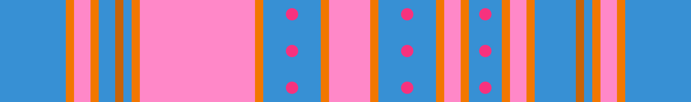

# Grand Canyon

## Blue

This is the only roller out of all the blue and orange rollers to have the largest gap, which spawns at the beginning. After this huge gap, there are 3 consecutive jumps you can easily make, until a wall hits you at the end.

This roller, while mostly straightforward, has created some of the hardest variations due to how little space you're given late game. With this roller, it is highly unlikely you will be receiving a huge timeout.
