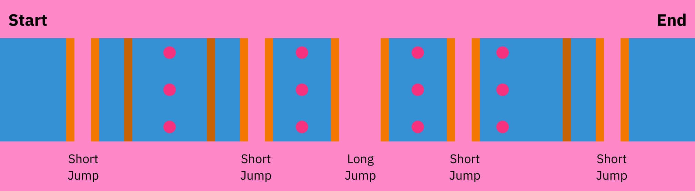

# 기둥 참호

## 파란색 롤

"기둥 참호" 패턴은 롤 오프에서 출현하는 모든 패턴 중 가장 많은 12개의 기둥을 가지고 있는 것에서 이름을 따왔습니다.

### 기억해야 할 사항

* **도랑 없이 연속된 2개의 벽으로 시작하며**, 이 두 벽으로 인한 공간 부족을 피하기 위해 주황색 롤에서 시작하는 것이 좋습니다.
* **롤의 가운데에는 3번의 연속 점프가 있습니다.** 이 공간을 활용하여 중앙에서 이동하는 다른 플레이어와의 충돌을 방지할 수 있습니다.
