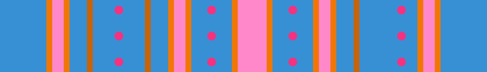

# Pillar Trench

## Blue

What makes this blue variant in particular is it's the only variation out of the 9 that can spawn the most pillars. It can easily be recognized from a "checkpoint" (two walls in a row without gaps) formed between its first two walls. This is the only variation that can spawn in a set of 4 with a total of 12 of them on just this variant. In the middle, there's 3 jumps you can make, with 2 small jumps surrounding a fairly medium-sized gap.
