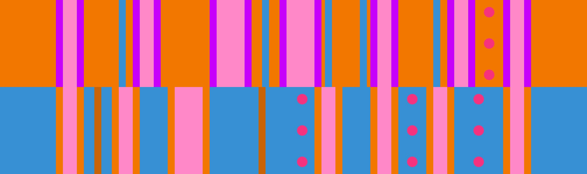

# 橙多挡板 + 蓝4

## 概述

[橙多挡板](../rolls/5-waller.zh.md) + [蓝4](../rolls/easy-4.zh.md#蓝轮)是最容易造成拥挤碰撞的版型之一。

## 路线

该版型平冠的关键是协作，玩家须尽可能避免与其他豆子切到同一条细边。尤其重要的是橙轮第二个挡板处，玩家应分散到挡板前和挡板后的不同细边上。 以下路线在全部12圈中均可使用。

### 挡板后细边

=== "第9圈"

    <video controls>
      <source src="../../images/variations/5-waller-easy-4-outer-orange-ledge-lap9.mp4" type="video/mp4">
    </video>

=== "第10圈"

    <video controls>
      <source src="../../images/variations/5-waller-easy-4-outer-orange-ledge-lap10.mp4" type="video/mp4">
    </video>

=== "第11圈"

    <video controls>
      <source src="../../images/variations/5-waller-easy-4-outer-orange-ledge-lap11.mp4" type="video/mp4">
    </video>

=== "第12圈"

    <video controls>
      <source src="../../images/variations/5-waller-easy-4-outer-orange-ledge-lap12.mp4" type="video/mp4">
    </video>

### 挡板前细边

=== "第9圈"

    <video controls>
      <source src="../../images/variations/5-waller-easy-4-inner-orange-ledge-lap9.mp4" type="video/mp4">
    </video>

=== "第10圈"

    <video controls>
      <source src="../../images/variations/5-waller-easy-4-inner-orange-ledge-lap10.mp4" type="video/mp4">
    </video>

=== "第11圈"

    <video controls>
      <source src="../../images/variations/5-waller-easy-4-inner-orange-ledge-lap11.mp4" type="video/mp4">
    </video>

=== "第12圈"

    <video controls>
      <source src="../../images/variations/5-waller-easy-4-inner-orange-ledge-lap12.mp4" type="video/mp4">
    </video>

## 平冠示例

你也可以在[Bilibili](https://www.bilibili.com/video/BV1PB4y1i7fh?p=4)观看全版型路线展示。
