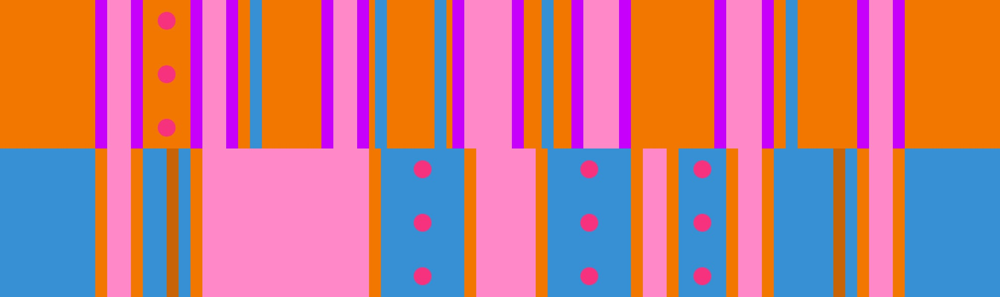

# 5 벽 + 그랜드 캐니언

## 개요

롤 오프에서 출현하는 20가지 변형 중 "세 번째로 어려운 변형"으로도 알려진 [5 벽](../rolls/5-waller.md) + [그랜드 캐니언](../rolls/grand-canyon.md) 변형은 공동우승이 가장 어려운 변형 중 하나입니다.

## 경로

9번째 랩에서 마지막 12번째 랩까지 4가지 경로를 선택할 수 있습니다.

### 파란색 그랜드 캐니언 패턴에서 시작하는 경로

=== "랩 9"

    <video controls>
      <source src="../../images/variations/5-waller-grand-canyon-start-on-blue-lap9.mp4" type="video/mp4">
    </video>

=== "랩 10"

    <video controls>
      <source src="../../images/variations/5-waller-grand-canyon-start-on-blue-lap10.mp4" type="video/mp4">
    </video>

=== "랩 11"

    <video controls>
      <source src="../../images/variations/5-waller-grand-canyon-start-on-blue-lap11.mp4" type="video/mp4">
    </video>

=== "랩 12"

    <video controls>
      <source src="../../images/variations/5-waller-grand-canyon-start-on-blue-lap12.mp4" type="video/mp4">
    </video>

#### 요약

1. [파란색 그랜드 캐니언](../rolls/grand-canyon.md) 패턴에서 시작해서 1번의 짧은 점프 후 금 벽을 만납니다.
2. [주황색 5 벽](../rolls/5-waller.md) 패턴의 파란 벽 뒤 좁은 공간으로 환승합니다.
3. 1번의 짧은 점프 후 [파란색 그랜드 캐니언](../rolls/grand-canyon.md) 패턴이 보이면 바로 환승합니다.

#### 난이도

| 랩 #  | 난이도      |
| ----- | ---------- |
| 9 #   | 중간        |
| 10 #  | 중간        |
| 11 #  | 어려움      |
| 12 #  | 어려움      |

### 파란색 그랜드 캐니언 패턴의 모서리를 이용하는 경로

=== "랩 9"

    <video controls>
      <source src="../../images/variations/5-waller-grand-canyon-gc-ledge-lap9.mp4" type="video/mp4">
    </video>

=== "랩 10"

    <video controls>
      <source src="../../images/variations/5-waller-grand-canyon-gc-ledge-lap10.mp4" type="video/mp4">
    </video>

=== "랩 11"

    <video controls>
      <source src="../../images/variations/5-waller-grand-canyon-gc-ledge-lap11.mp4" type="video/mp4">
    </video>

=== "랩 12"

    <video controls>
      <source src="../../images/variations/5-waller-grand-canyon-gc-ledge-lap12.mp4" type="video/mp4">
    </video>

#### 요약

1. [주황색 5 벽](../rolls/5-waller.md) 패턴에서 1번의 점프로 시작합니다.
2. [파란색 그랜드 캐니언](../rolls/grand-canyon.md) 패턴의 금 벽 뒤에 있는 좁은 공간으로 환승합니다.
3. 바로 [주황색 5 벽](../rolls/5-waller.md) 패턴으로 점프해서 환승합니다.
4. [주황색 5 벽](../rolls/5-waller.md) 패턴에서 머무르다가 [파란색 그랜드 캐니언](../rolls/grand-canyon.md) 패턴이 나타나면 점프해서 환승합니다.

#### 난이도

| 랩 #  | 난이도      |
| ----- | ---------- |
| 9 #   | 중간        |
| 10 #  | 중간        |
| 11 #  | 어려움      |
| 12 #  | 어려움      |

### 주황색 5 벽 패턴의 바깥쪽 벽 점프를 이용하는 경로

=== "랩 9"

    <video controls>
      <source src="../../images/variations/5-waller-grand-canyon-outer-wall-jump-lap9.mp4" type="video/mp4">
    </video>

=== "랩 10"

    <video controls>
      <source src="../../images/variations/5-waller-grand-canyon-outer-wall-jump-lap10.mp4" type="video/mp4">
    </video>

=== "랩 11"

    <video controls>
      <source src="../../images/variations/5-waller-grand-canyon-outer-wall-jump-lap11.mp4" type="video/mp4">
    </video>

=== "랩 12"

    <video controls>
      <source src="../../images/variations/5-waller-grand-canyon-outer-wall-jump-lap12.mp4" type="video/mp4">
    </video>

#### 요약

1. [주황색 5 벽](../rolls/5-waller.md) 패턴에서 1번의 점프로 시작합니다.
2. [주황색 5 벽](../rolls/5-waller.md) 패턴의 파란 벽을 벽 점프 다이브를 활용해서 넘어갑니다.
3. [주황색 5 벽](../rolls/5-waller.md) 패턴을 가로질러서 다시 [파란색 그랜드 캐니언](../rolls/grand-canyon.md) 패턴으로 점프해서 환승합니다.

#### 난이도

| 랩 #  | 난이도      |
| ----- | ---------- |
| 9 #   | 어려움      |
| 10 #  | 어려움      |
| 11 #  | 어려움      |
| 12 #  | 어려움      |

### Rainbow의 경로

=== "랩 9"

    <video controls>
      <source src="../../images/variations/5-waller-grand-canyon-rainbows-path-lap9.mp4" type="video/mp4">
    </video>

=== "랩 10"

    <video controls>
      <source src="../../images/variations/5-waller-grand-canyon-rainbows-path-lap10.mp4" type="video/mp4">
    </video>

=== "랩 11"

    <video controls>
      <source src="../../images/variations/5-waller-grand-canyon-rainbows-path-lap11.mp4" type="video/mp4">
    </video>

=== "랩 12"

    <video controls>
      <source src="../../images/variations/5-waller-grand-canyon-rainbows-path-lap12.mp4" type="video/mp4">
    </video>

#### 요약

1. [파란색 그랜드 캐니언](../rolls/grand-canyon.md) 패턴에서 시작해서 1번의 점프로 도랑을 넘어갑니다.
2. [파란색 그랜드 캐니언](../rolls/grand-canyon.md) 패턴의 바깥쪽에서 벽 점프로 넘어갑니다.
3. 벽 점프 후 금 벽 좁은 공간을 가로질러 [주황색 5 벽](../rolls/5-waller.md) 패턴으로 점프 다이브합니다.
4. 넓은 도랑을 점프 다이브로 넘어가 파란 벽을 만납니다.
5. 바로 [파란색 그랜드 캐니언](../rolls/grand-canyon.md) 패턴으로 환승합니다.

#### 난이도

| 랩 #  | 난이도      |
| ----- | ---------- |
| 9 #   | 매우 어려움  |
| 10 #  | 매우 어려움  |
| 11 #  | 매우 어려움  |
| 12 #  | 매우 어려움  |

## 권장하는 경로

다음은 이 변형에 대한 이상적인 3인 공동우승의 예시입니다.

* 1명이 9번째 랩에서 마지막 12번째 랩 동안 [파란색 롤에서 시작하는 경로](./5-waller-grand-canyon.md#파란색-롤에서-시작하는-경로)를 시도합니다.
* 1명이 9번째 랩에서 마지막 12번째 랩 동안 [그랜드 캐니언 모서리를 이용하는 경로](./5-waller-grand-canyon.md#그랜드-캐니언-모서리를-이용하는-경로)를 시도합니다.
* 1명이 9번째 랩에서 마지막 12번째 랩 동안 [바깥쪽 벽 점프를 이용하는 경로](./5-waller-grand-canyon.md#바깥쪽-벽-점프를-이용하는-경로)를 시도합니다.

## 공동우승 예시

롤 오프에서 출현하는 20가지 변형 패턴에 대한 모든 경로를 [유튜브](https://www.youtube.com/playlist?list=PLG_QNSp9ZgJLWYSNl4vY26VJCZeOQHO1F)에서 보실 수 있습니다.
