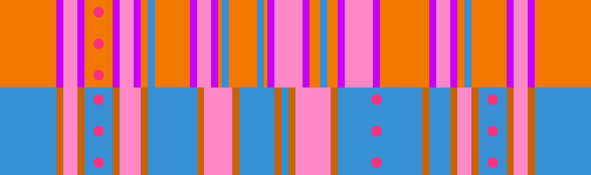

# 5 벽 + 오픈-클로즈드 변형

## 개요

[5 벽](../rolls/5-waller.md) + [오픈-클로즈드](../rolls/closed-open-open-closed.md#파란색-롤) 변형은 다른 플레이어와의 충돌을 피하고자 다소 복잡한 경로로 진행해야 할 뿐만 아니라 그마저 진행하기 까다롭기 때문에 20가지 변형 중 가장 어렵습니다.

## 경로

### 7-8 랩

7번째 랩에서 8번째 랩 구간은 다른 플레이어와의 충돌 가능성이 매우 높기 때문에 특히 위험합니다.

#### 표준 경로

일반적으로 진행 가능한 표준 경로는 파란색 롤에서 3번의 점프로 시작 후 첫 번째 금 벽을 만나면 주황색 롤로 환승하는 경로입니다. 8번째 랩에서는 환승이 매우 타이트하므로 주황색 롤로 환승할 때는 다른 플레이어와의 충돌을 방지하기 위해 파란색 롤에서 처음 마주하는 벽까지 일직선으로 달리는 것이 좋습니다.

<video controls>
  <source src="../../images/variations/5-waller-open-closed-lap8-standard-path.mp4" type="video/mp4">
</video>

#### 대체 경로

7번째 랩에서 8번째 랩까지 여전히 플레이어가 많이 남아 있다면, 파란색 롤에서 2번의 점프로 시작해서 주황색 롤의 파란 벽이 지나갈 때 주황색 롤의 파란 벽 앞 작은 공간으로 환승합니다. 다시 파란색 롤의 금 벽이 지나갈 때 파란색 롤의 금 벽 앞 작은 공간으로 환승 후 바로 큰 간격을 점프 다이브로 넘어가는 게 더 안전한 대체 경로가 될 수 있습니다. 이 경로는 실행하기는 매우 어렵지만, 때로는 플레이어 간의 충돌을 피할 수 있는 확실한 경로입니다.

<video controls>
  <source src="../../images/variations/5-waller-open-closed-lap8-alternate-path.mp4" type="video/mp4">
</video>

#### 바깥쪽 벽 점프를 이용하는 경로

7번째 랩에서 8번째 랩 구간에서 플레이어간의 충돌을 피하는 또 다른 경로는 파란색 롤에서 벽 점프를 하는 경로입니다. [오픈-클로즈드](../rolls/closed-open-open-closed.md#파란색-롤) 패턴에서 벽 점프 스킬을 자유롭게 구사할 수 있다면 이 방법이 훨씬 더 안전한 대체 경로가 될 수 있습니다.

<video controls>
  <source src="../../images/variations/5-waller-open-closed-lap8-outer-wall-jump.mp4" type="video/mp4">
</video>

### 9번째 랩에서 마지막 12번째 랩

9번째 랩에서 마지막 12번째 랩 구간은 극도로 어려워지는 구간입니다. 생존을 위해 아래 경로를 외우는 것을 적극 권장합니다.

9번째 랩에서 마지막 12번째 랩은 5가지 경로로 진행할 수 있습니다.

#### Syed의 경로

<video controls>
  <source src="../../images/variations/5-waller-open-closed-syeds-path.mp4" type="video/mp4">
</video>

##### 요약

1. 파란색 롤에서 3번의 연속 점프로 시작합니다.
2. 주황색 롤의 두 번째 파란 벽이 지나갈 때 파란 벽 앞 작은 공간으로 환승합니다.
3. 주황색 롤의 세 번째 파란 벽 앞에 있는 아주 작은 공간으로 점프해서 넘어갑니다.
4. 파란색 롤로 다시 점프 환승합니다.

##### 난이도

| 랩 #  | 난이도     |
| ----- | ---------- |
| 9 #   | 중간       |
| 10 #  | 중간       |
| 11 #  | 중간       |
| 12 #  | 중간       |

#### City의 경로

<video controls>
  <source src="../../images/variations/5-waller-open-closed-citys-path.mp4" type="video/mp4">
</video>

##### 요약

1. 파란색 롤에서 3번의 연속 점프로 시작합니다.
2. 주황색 롤의 세 번째 파란 벽 앞에 있는 아주 작은 공간으로 가로질러 점프 환승합니다.
3. 파란색 롤로 다시 점프 환승합니다.

##### 난이도

| 랩 #  | 난이도     |
| ----- | ---------- |
| 9 #   | 중간       |
| 10 #  | 중간       |
| 11 #  | 어려움     |
| 12 #  | 매우 어려움 |

#### SH3RKH4N의 경로

<video controls>
  <source src="../../images/variations/5-waller-open-closed-sh3rkh4ns-path.mp4" type="video/mp4">
</video>

##### 요약

1. 파란색 롤에서 3번의 연속 점프로 시작합니다.
2. 주황색 롤에서 두 번째 파란 벽이 지나가면 파란 벽 앞 공간으로 환승합니다.
3. 방향을 전환해서 파란색 롤로 다시 점프 환승합니다.

##### 난이도

| 랩 #  | 난이도     |
| ----- | ---------- |
| 9 #   | 매우 어려움 |
| 10 #  | 어려움     |
| 11 #  | 중간       |
| 12 #  | 중간       |

#### Suki의 경로

<video controls>
  <source src="../../images/variations/5-waller-open-closed-sukis-path.mp4" type="video/mp4">
</video>

##### 요약

1. 파란색 롤에서 2번의 연속 점프로 시작합니다.
2. 주황색 롤로 환승합니다.
3. 환승 후 긴 간격을 점프 다이브로 넘어갑니다.
4. 파란색 롤의 첫 번째 금 벽 뒤의 작은 공간으로 환승합니다.
5. 파란색 롤의 큰 간격을 가로질러 점프 다이브로 넘어갑니다.

##### 난이도

| 랩 #  | 난이도      |
| ----- | ---------- |
| 9 #   | 어려움      |
| 10 #  | 어려움      |
| 11 #  | 어려움      |
| 12 #  | 어려움      |

#### EChan의 경로

<video controls>
  <source src="../../images/variations/5-waller-open-closed-echans-path.mp4" type="video/mp4">
</video>

##### 요약

1. 파란색 롤에서 2번의 연속 점프로 시작합니다.
2. 주황색 롤로 환승합니다.
3. 환승 후 긴 간격을 점프 다이브로 넘어갑니다.
4. 파란색 롤의 첫 번째 금 벽 뒤의 작은 공간으로 환승합니다.
5. 파란색 롤에 머무르다가 주황색 롤의 세 번째 파란 벽을 지나가면 주황색 롤로 환승합니다.

##### 난이도

| 랩 #  | 난이도      |
| ----- | ---------- |
| 9 #   | 중간        |
| 10 #  | 중간        |
| 11 #  | 어려움      |
| 12 #  | 매우 어려움 |

## 권장하는 경로

다음은 이 변형에 대한 이상적인 2인 공동우승의 예시입니다.

* 1명이 9번째 랩에서 10번째 랩 동안 [Syed의 경로](./5-waller-open-closed.md#Syed의-경로)를, 11번째 랩에서 마지막 12번째 랩 동안은 [SH3RKH4N의 경로](./5-waller-open-closed.md#SH3RKH4N의-경로)를 시도합니다.
* 1명이 9번째 랩에서 10번째 랩 동안 [EChan의 경로](./5-waller-open-closed.md#EChan의-경로)를, 11번째 랩에서 마지막 12번째 랩 동안은 [Suki의 경로](./5-waller-open-closed.md#Suki의-경로)를 시도합니다.

## 공동우승 예시

롤 오프에서 출현하는 20가지 변형 패턴에 대한 모든 경로를 [유튜브](https://www.youtube.com/playlist?list=PLG_QNSp9ZgJLWYSNl4vY26VJCZeOQHO1F)에서 보실 수 있습니다.
