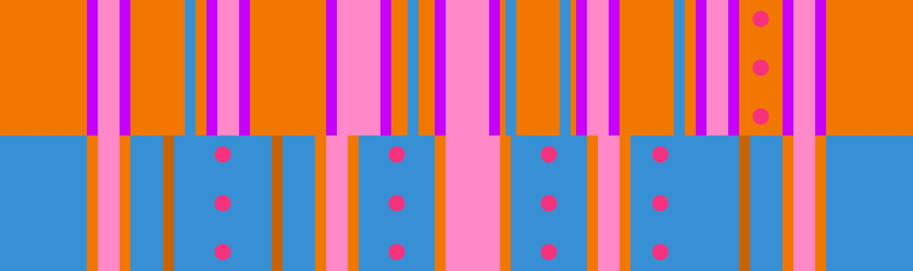

# 5 벽 + 기둥 참호

## 개요

[5 벽](../rolls/5-waller.md) + [기둥 참호](../rolls/pillar-trench.md) 변형은 가장 쉬운 난도의 [5 벽](../rolls/5-waller.md) 변형입니다. 랩의 시작부터 플레이어 간의 충돌을 피하는 게 어려울 수 있지만, 랩의 중간과 마지막 구간에서 [파란색 기둥 참호](../rolls/pillar-trench.md) 패턴의 가운데에 여유 공간이 많기 때문에 쉽게 진행 가능합니다.

## 경로

### 경로 예시

=== "7번째 랩"

    <video controls>
      <source src="../../images/variations/5-waller-pillar-trench-example-path-lap7.mp4" type="video/mp4">
    </video>

=== "8번째 랩"

    <video controls>
      <source src="../../images/variations/5-waller-pillar-trench-example-path-lap8.mp4" type="video/mp4">
    </video>

=== "9번째 랩"

    <video controls>
      <source src="../../images/variations/5-waller-pillar-trench-example-path-lap9.mp4" type="video/mp4">
    </video>

=== "10번째 랩"

    <video controls>
      <source src="../../images/variations/5-waller-pillar-trench-example-path-lap10.mp4" type="video/mp4">
    </video>

=== "11번째 랩"

    <video controls>
      <source src="../../images/variations/5-waller-pillar-trench-example-path-lap11.mp4" type="video/mp4">
    </video>

=== "12번째 랩"

    <video controls>
      <source src="../../images/variations/5-waller-pillar-trench-example-path-lap12.mp4" type="video/mp4">
    </video>

## 공동우승 예시

롤 오프에서 출현하는 20가지 변형 패턴에 대한 모든 경로를 [유튜브](https://www.youtube.com/playlist?list=PLG_QNSp9ZgJLWYSNl4vY26VJCZeOQHO1F)에서 보실 수 있습니다.
