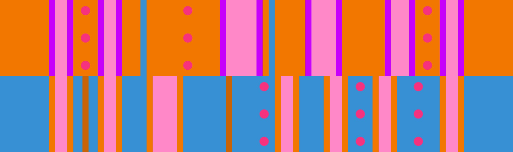

# 닫힘-열림 + 이지 4

## 개요

[닫힘-열림](../rolls/closed-open-open-closed#주황색-패턴) + [이지 4](../rolls/easy-4.md#파란색-패턴) 변형은 랩을 시작할 때 벽으로 인해 여유 공간이 적으므로 후반전에서 어려울 수 있습니다. 랩 중반은 [주황색 닫힘-열림](../rolls/closed-open-open-closed#주황색-패턴) 패턴의 넓은 도랑이 [파란색 이지 4](../rolls/easy-4.md#파란색-패턴) 패턴의 두 번째 벽과 어중간하게 정렬되어 환승이 어려워지기 때문에 조심해야 합니다. 랩의 후반전은 [파란색 이지 4](../rolls/easy-4.md#파란색-패턴) 패턴에서 4번 연속 점프, [주황색 닫힘-열림](../rolls/closed-open-open-closed#주황색-패턴) 패턴에서 3번 연속 점프로 경로를 진행할 수 있습니다.

!!! 노트 "재밌는 사실 하나"

    이 변형은 롤 오프가 시작되기 전 [썸네일](../assets/social-preview.jpg)에 나타나는 변형이며 "썸네일 변형"이라고도 불립니다.

## 경로

### 경로 예시

<video controls>
  <source src="../../images/variations/closed-open-easy-4-standard-path.mp4" type="video/mp4">
</video>

## 공동우승 예시

롤 오프에서 출현하는 20가지 변형 패턴에 대한 모든 경로를 [유튜브](https://www.youtube.com/playlist?list=PLG_QNSp9ZgJLWYSNl4vY26VJCZeOQHO1F)에서 보실 수 있습니다.
