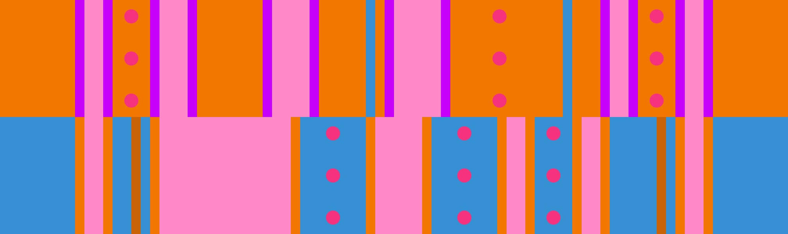

# Closed-Open + Grand Canyon

## Overview

Also known as the "2nd Hardest Variation", [Closed-Open](../rolls/closed-open-open-closed.md#orange) + [Grand Canyon](../rolls/grand-canyon.md) is notorious for being extremely difficult to timeout.

This variation becomes very difficult starting on the 9th lap at around 3:30 into the timeout. This is because it becomes very tricky to get past the first wall on orange due to the presence of the large grand canyon gap on blue. Once you do get past the first wall on orange, the remainder of the lap is straightforward, with 3 easy jumps in the middle of blue and 3 easy jumps at the end of orange.

## Paths

There are 5 possible paths to take on laps 9-12 of the timeout:

### Grand Canyon Ledge

=== "Lap 9"

    <video controls>
      <source src="../../images/variations/closed-open-grand-canyon-gc-ledge-lap9.mp4" type="video/mp4">
    </video>

=== "Lap 10"

    <video controls>
      <source src="../../images/variations/closed-open-grand-canyon-gc-ledge-lap10.mp4" type="video/mp4">
    </video>

=== "Lap 11"

    <video controls>
      <source src="../../images/variations/closed-open-grand-canyon-gc-ledge-lap11.mp4" type="video/mp4">
    </video>

=== "Lap 12"

    <video controls>
      <source src="../../images/variations/closed-open-grand-canyon-gc-ledge-lap12.mp4" type="video/mp4">
    </video>

#### Summary

1. Start on orange
2. Transfer to the small blue grand canyon ledge
3. Jump back to orange after the wall passes

#### Difficulty

| Lap # | Difficulty |
| ----- | ---------- |
| 9     | Medium     |
| 10    | Medium     |
| 11    | Hard       |
| 12    | Very hard  |

### Inner Wall Jump

=== "Lap 10"

    <video controls>
      <source src="../../images/variations/closed-open-grand-canyon-inner-wall-jump-lap10.mp4" type="video/mp4">
    </video>

=== "Lap 11"

    <video controls>
      <source src="../../images/variations/closed-open-grand-canyon-inner-wall-jump-lap11.mp4" type="video/mp4">
    </video>

=== "Lap 12"

    <video controls>
      <source src="../../images/variations/closed-open-grand-canyon-inner-wall-jump-lap12.mp4" type="video/mp4">
    </video>

#### Summary

1. Start on orange
2. Inner wall jump on the left side of orange
3. Transfer back to blue

#### Difficulty

| Lap # | Difficulty |
| ----- | ---------- |
| 9     | Hard       |
| 10    | Hard       |
| 11    | Hard       |
| 12    | Hard       |

### Outer Wall Jump

=== "Lap 9"

    <video controls>
      <source src="../../images/variations/closed-open-grand-canyon-outer-wall-jump-lap9.mp4" type="video/mp4">
    </video>

=== "Lap 10"

    <video controls>
      <source src="../../images/variations/closed-open-grand-canyon-outer-wall-jump-lap10.mp4" type="video/mp4">
    </video>

=== "Lap 11"

    <video controls>
      <source src="../../images/variations/closed-open-grand-canyon-outer-wall-jump-lap11.mp4" type="video/mp4">
    </video>

=== "Lap 12"

    <video controls>
      <source src="../../images/variations/closed-open-grand-canyon-outer-wall-jump-lap12.mp4" type="video/mp4">
    </video>

#### Summary

1. Start on orange
2. Outer wall jump on the right side of orange
3. Run diagonally across the roll and jump dive to the small orange ledge
4. Transfer back to blue

#### Difficulty

| Lap # | Difficulty |
| ----- | ---------- |
| 9     | Medium     |
| 10    | Medium     |
| 11    | Medium     |
| 12    | Medium     |

### Piggy's Path

=== "Lap 10"

    <video controls>
      <source src="../../images/variations/closed-open-grand-canyon-piggys-path-lap10.mp4" type="video/mp4">
    </video>

=== "Lap 11"

    <video controls>
      <source src="../../images/variations/closed-open-grand-canyon-piggys-path-lap11.mp4" type="video/mp4">
    </video>

=== "Lap 12"

    <video controls>
      <source src="../../images/variations/closed-open-grand-canyon-piggys-path-lap12.mp4" type="video/mp4">
    </video>

#### Summary

1. Start on orange
2. Run up to the front of the wall
3. Pause and then jump dive back to blue

#### Difficulty

| Lap # | Difficulty |
| ----- | ---------- |
| 9     | Impossible |
| 10    | Very hard  |
| 11    | Hard       |
| 12    | Medium     |

### Rainbow's Path

=== "Lap 9"

    <video controls>
      <source src="../../images/variations/closed-open-grand-canyon-rainbows-path-lap9.mp4" type="video/mp4">
    </video>

=== "Lap 10"

    <video controls>
      <source src="../../images/variations/closed-open-grand-canyon-rainbows-path-lap10.mp4" type="video/mp4">
    </video>

=== "Lap 11"

    <video controls>
      <source src="../../images/variations/closed-open-grand-canyon-rainbows-path-lap11.mp4" type="video/mp4">
    </video>

=== "Lap 12"

    <video controls>
      <source src="../../images/variations/closed-open-grand-canyon-rainbows-path-lap12.mp4" type="video/mp4">
    </video>

#### Summary

1. Start on blue
2. Outer wall jump on the right side of blue
3. Run across the grand canyon ledge and jump dive to orange
4. Transfer back to blue

#### Difficulty

| Lap # | Difficulty |
| ----- | ---------- |
| 9     | Very hard  |
| 10    | Very hard  |
| 11    | Very hard  |
| 12    | Very hard  |

## Recommended Pathing

Here is an example of what an ideal 3 person timeout looks like for this variation:

* 1 player outer wall jumps laps 9-12
* 1 player inner wall jumps laps 9-12
* 1 player takes grand canyon ledge laps 9-11 and takes piggy path lap 12

## Example Timeouts

View all Roll Off paths for all 20 variations on [YouTube](https://www.youtube.com/playlist?list=PLG_QNSp9ZgJLWYSNl4vY26VJCZeOQHO1F).
