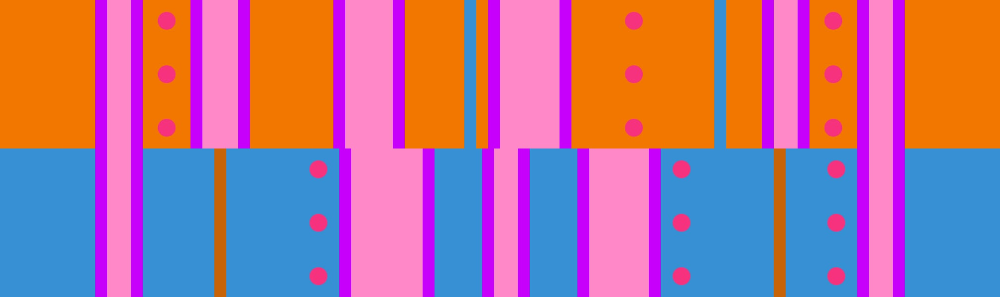

# 橙2 + 蓝浮岛

## 概述

在特定的时间段中，[橙2](../rolls/closed-open-open-closed.zh.md#橙轮) + [蓝浮岛](../rolls/isolated-duo.zh.md#蓝轮)中蓝轮的大坑会和橙轮的中坑同时出现，造成一定困难。记住蓝轮浮岛前的坑是[大坑](../advanced/isolated-duo-god-jumps.zh.md)，跳过去难度较高，而浮岛后的中坑则相对容易跳且可以用来防挤。

## 路线

### 路线示例

=== "第7圈"

    <video controls>
      <source src="../../images/variations/closed-open-isolated-duo-example-path-lap7.mp4" type="video/mp4">
    </video>

=== "第8圈"

    <video controls>
      <source src="../../images/variations/closed-open-isolated-duo-example-path-lap8.mp4" type="video/mp4">
    </video>

=== "第9圈"

    <video controls>
      <source src="../../images/variations/closed-open-isolated-duo-example-path-lap9.mp4" type="video/mp4">
    </video>

=== "第10圈"

    <video controls>
      <source src="../../images/variations/closed-open-isolated-duo-example-path-lap10.mp4" type="video/mp4">
    </video>

=== "第11圈"

    <video controls>
      <source src="../../images/variations/closed-open-isolated-duo-example-path-lap11.mp4" type="video/mp4">
    </video>

=== "第12圈"

    <video controls>
      <source src="../../images/variations/closed-open-isolated-duo-example-path-lap12.mp4" type="video/mp4">
    </video>

## 其他教学

你也可以在Bilibili观看[橙2蓝浮岛的路线展示](https://www.bilibili.com/video/BV1PB4y1i7fh?p=3)。
