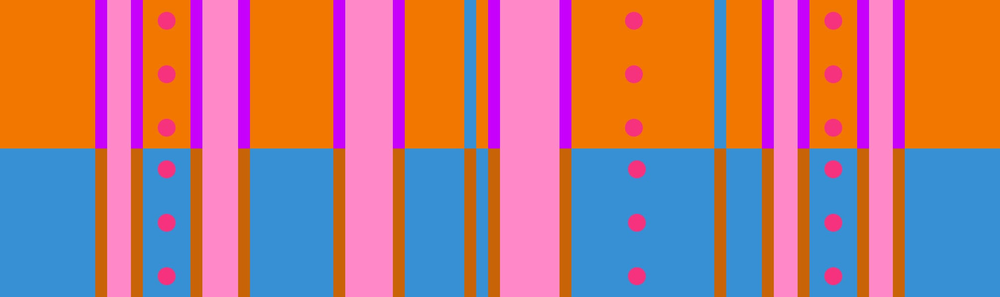

# 클로즈드-오픈 + 오픈-클로즈드

## 개요

[클로즈드-오픈](../rolls/closed-open-open-closed.md#주황색-롤) + [오픈-클로즈드](../rolls/closed-open-open-closed.md#파란색-롤) 변형은 공동우승하기 가장 어려운 변형 중 하나입니다. 일반적으로 8번째 랩까지는 [파란색 오픈-클로즈드](../rolls/closed-open-open-closed.md#파란색-롤) 패턴에서 3번의 연속 점프로 시작하고 [주황색 클로즈드-오픈](../rolls/closed-open-open-closed.md#주황색-롤) 패턴에서 끝나는 경로를 이용할 수 있습니다. 하지만 슬라임이 최대 높이에 도달하는 9번째 랩에서 마지막 12번째 랩까지는 이 경로가 매우 어려워집니다.

## 경로

9번째 랩에서 마지막 12번째 랩까지 3가지 경로를 선택할 수 있습니다.

### 알렉스의 경로

<video controls>
  <source src="../../images/variations/closed-open-open-closed-alexs-path.mp4" type="video/mp4">
</video>

#### 요약

1. [파란색 오픈-클로즈드](../rolls/closed-open-open-closed.md#파란색-롤) 패턴에서 시작해서 2번의 점프로 도랑을 넘어갑니다.
2. [주황색 클로즈드-오픈](../rolls/closed-open-open-closed.md#주황색-롤) 패턴의 파란 벽이 지나가면 환승합니다.
3. [주황색 클로즈드-오픈](../rolls/closed-open-open-closed.md#주황색-롤) 패턴을 달리다가 넓은 도랑을 나타나면 점프 다이브로 넘어갑니다.
4. 바로 준비하고 [파란색 오픈-클로즈드](../rolls/closed-open-open-closed.md#파란색-롤) 패턴으로 점프 다이브해서 환승합니다.

#### 난이도

| 랩 #  | 난이도      |
| ----- | ---------- |
| 9 #   | 어려움      |
| 10 #  | 어려움      |
| 11 #  | 중간        |
| 12 #  | 중간        |

### PG의 경로

<video controls>
  <source src="../../images/variations/closed-open-open-closed-pgs-path.mp4" type="video/mp4">
</video>

#### 요약

1. [파란색 오픈-클로즈드](../rolls/closed-open-open-closed.md#파란색-롤) 패턴에서 시작해서 3번의 점프로 도랑을 넘어갑니다.
2. [주황색 클로즈드-오픈](../rolls/closed-open-open-closed.md#주황색-롤) 패턴의 파란 벽 앞에 있는 좁은 공간으로 점프해서 환승합니다.
3. 바로 준비하고 [파란색 오픈-클로즈드](../rolls/closed-open-open-closed.md#파란색-롤) 패턴으로 점프 다이브해서 환승합니다.

#### 난이도

| 랩 #  | 난이도      |
| ----- | ---------- |
| 9 #   | 어려움      |
| 10 #  | 어려움      |
| 11 #  | 중간        |
| 12 #  | 중간        |

### JD의 경로

<video controls>
  <source src="../../images/variations/closed-open-open-closed-jds-path.mp4" type="video/mp4">
</video>

#### 요약

1. [파란색 오픈-클로즈드](../rolls/closed-open-open-closed.md#파란색-롤) 패턴에서 시작해서 2번의 점프로 도랑을 넘어갑니다.
2. [주황색 클로즈드-오픈](../rolls/closed-open-open-closed.md#주황색-롤) 패턴의 파란 벽이 지나가면 환승합니다.
3. [주황색 클로즈드-오픈](../rolls/closed-open-open-closed.md#주황색-롤) 패턴을 달리다가 [파란색 오픈-클로즈드](../rolls/closed-open-open-closed.md#파란색-롤) 패턴의 금 벽이 나타나면 금 벽 뒤쪽 좁은 공간으로 환승합니다.
4. 다시 [주황색 클로즈드-오픈](../rolls/closed-open-open-closed.md#주황색-롤) 패턴의 파란 벽이 지나가면 환승합니다.

#### 난이도

| 랩 #  | 난이도      |
| ----- | ---------- |
| 9 #   | 어려움      |
| 10 #  | 중간        |
| 11 #  | 중간        |
| 12 #  | 어려움      |

## 권장하는 경로

다음은 이 변형에 대한 이상적인 3인 공동우승의 예시입니다.

* 1명이 9번째 랩에서 마지막 12번째 랩 동안 [알렉스의 경로](./closed-open-open-closed.md#알렉스의-경로)를 시도합니다.
* 1명이 9번째 랩에서 마지막 12번째 랩 동안 [PG의 경로](./closed-open-open-closed.md#PG의-경로)를 시도합니다.
* 1명이 9번째 랩에서 마지막 12번째 랩 동안 [JD의 경로](./closed-open-open-closed.md#JD의-경로)를 시도합니다.

이 변형에서 주의해야 할 점은 두 명의 플레이어가 [주황색 클로즈드-오픈](../rolls/closed-open-open-closed.md#주황색-롤) 패턴의 두 번째 파란 벽의 좁은 공간에서 마주쳐서 충돌하는 경우입니다. 두 플레이어가 좁은 공간에서 마주쳤다면 한 플레이어가 [파란색 오픈-클로즈드](../rolls/closed-open-open-closed.md#파란색-롤) 패턴으로 재빠르게 점프로 환승해서 충돌을 피하는 게 매우 중요합니다. ([알렉스의 경로](./closed-open-open-closed.md#알렉스의-경로) 7초~10초 참고)

## 공동우승 예시

롤 오프에서 출현하는 20가지 변형 패턴에 대한 모든 경로를 [유튜브](https://www.youtube.com/playlist?list=PLG_QNSp9ZgJLWYSNl4vY26VJCZeOQHO1F)에서 보실 수 있습니다.
