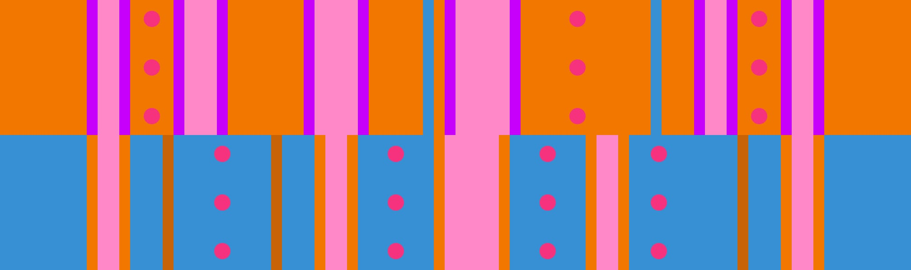

# 橙2 + 蓝多挡板

## 概述

[橙2](../rolls/closed-open-open-closed.zh.md#橙轮) + [蓝多挡板](../rolls/pillar-trench.zh.md)开头处略有些拥挤，不过之后空间就很宽裕了，可以在蓝轮连续跳3个坑，也可以在橙轮结尾连续跳3个坑。由于橙轮开头可以连续跳2个坑，空间较大，后期一般建议从橙轮开始跑。

## 路线

### 路线示例

=== "第7圈"

    <video controls>
      <source src="../../images/variations/closed-open-pillar-trench-example-path-lap7.mp4" type="video/mp4">
    </video>

=== "第8圈"

    <video controls>
      <source src="../../images/variations/closed-open-pillar-trench-example-path-lap8.mp4" type="video/mp4">
    </video>

=== "第9圈"

    <video controls>
      <source src="../../images/variations/closed-open-pillar-trench-example-path-lap9.mp4" type="video/mp4">
    </video>

=== "第10圈"

    <video controls>
      <source src="../../images/variations/closed-open-pillar-trench-example-path-lap10.mp4" type="video/mp4">
    </video>

=== "第11圈"

    <video controls>
      <source src="../../images/variations/closed-open-pillar-trench-example-path-lap11.mp4" type="video/mp4">
    </video>

=== "第12圈"

    <video controls>
      <source src="../../images/variations/closed-open-pillar-trench-example-path-lap12.mp4" type="video/mp4">
    </video>

## 平冠示例

你也可以在[Bilibili](https://www.bilibili.com/video/BV1PB4y1i7fh?p=3)观看全版型路线展示。
