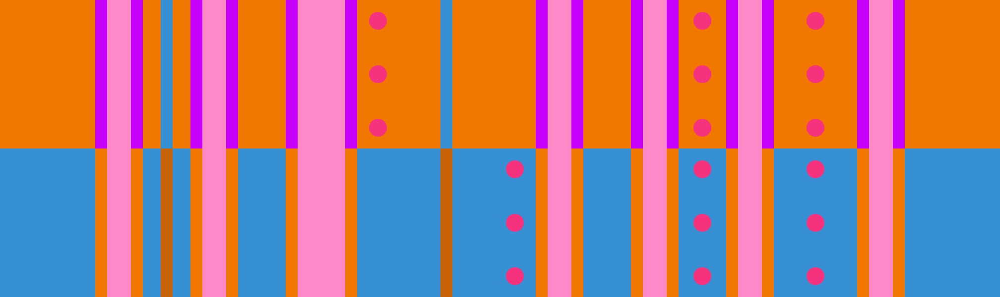

# Easy 4 + Easy 4

## Overview

[Easy 4](../rolls/easy-4.md#orange) + [Easy 4](../rolls/easy-4.md#blue), also known as "4 by 4", is the easiest roll off variation.

## Paths

To timeout this variation, simply jump 4 times on orange, transfer to blue, and jump 4 times on blue. This path can be done all 12 laps.

Beginning with the 9th lap, it can be useful to start with 3 jumps on orange instead. By transfering to blue earlier, you give more space for others to follow behind.

### Example Path

=== "Lap 7"

    <video controls>
      <source src="../../images/variations/easy-4-easy-4-example-path-lap7.mp4" type="video/mp4">
    </video>

=== "Lap 8"

    <video controls>
      <source src="../../images/variations/easy-4-easy-4-example-path-lap8.mp4" type="video/mp4">
    </video>

=== "Lap 9"

    <video controls>
      <source src="../../images/variations/easy-4-easy-4-example-path-lap9.mp4" type="video/mp4">
    </video>

=== "Lap 10"

    <video controls>
      <source src="../../images/variations/easy-4-easy-4-example-path-lap10.mp4" type="video/mp4">
    </video>

=== "Lap 11"

    <video controls>
      <source src="../../images/variations/easy-4-easy-4-example-path-lap11.mp4" type="video/mp4">
    </video>

=== "Lap 12"

    <video controls>
      <source src="../../images/variations/easy-4-easy-4-example-path-lap12.mp4" type="video/mp4">
    </video>

<video controls>
  <source src="../../images/variations/easy-4-easy-4-standard-path.mp4" type="video/mp4">
</video>

<video controls>
  <source src="../../images/variations/easy-4-easy-4-alternate-path.mp4" type="video/mp4">
</video>

## Example Timeouts

View all Roll Off paths for all 20 variations on [YouTube](https://www.youtube.com/playlist?list=PLG_QNSp9ZgJLWYSNl4vY26VJCZeOQHO1F).
