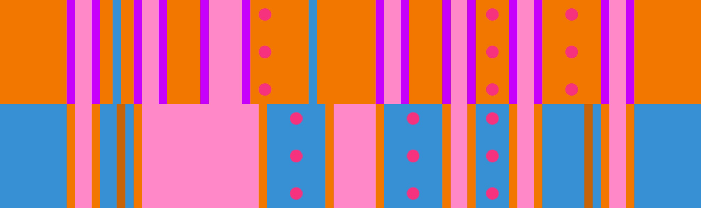

# Easy 4 + Grand Canyon

## Overview

[Easy 4](../rolls/easy-4.md#orange) + [Grand Canyon](../rolls/grand-canyon.md) is the easiest grand canyon variation, due to the fact that the 4 easy jumps to start on orange means you can easily avoid the large gap on Grand Canyon entirely. That said, it is still somewhat difficult due to some of the tight pinches that are required late in the timeout.

## Paths

There are 3 paths you can take to survive the final transfer on laps 9-12 of the timeout. I recommend taking whichever path has less players, as it can be very easy to collide otherwise.

### End On Orange

=== "Lap 9"

    <video controls>
      <source src="/images/variations/easy-4-grand-canyon-end-on-orange-lap9.mp4" type="video/mp4">
    </video>

=== "Lap 10"

    <video controls>
      <source src="/images/variations/easy-4-grand-canyon-end-on-orange-lap10.mp4" type="video/mp4">
    </video>

=== "Lap 11"

    <video controls>
      <source src="/images/variations/easy-4-grand-canyon-end-on-orange-lap11.mp4" type="video/mp4">
    </video>

=== "Lap 12"

    <video controls>
      <source src="/images/variations/easy-4-grand-canyon-end-on-orange-lap12.mp4" type="video/mp4">
    </video>

#### Difficulty

| Lap # | Difficulty |
| ----- | ---------- |
| 9     | Easy       |
| 10    | Easy       |
| 11    | Medium     |
| 12    | Medium     |

### End On Blue

=== "Lap 9"

    <video controls>
      <source src="/images/variations/easy-4-grand-canyon-end-on-blue-lap9.mp4" type="video/mp4">
    </video>

=== "Lap 10"

    <video controls>
      <source src="/images/variations/easy-4-grand-canyon-end-on-blue-lap10.mp4" type="video/mp4">
    </video>

=== "Lap 11"

    <video controls>
      <source src="/images/variations/easy-4-grand-canyon-end-on-blue-lap11.mp4" type="video/mp4">
    </video>

=== "Lap 12"

    <video controls>
      <source src="/images/variations/easy-4-grand-canyon-end-on-blue-lap12.mp4" type="video/mp4">
    </video>

#### Difficulty

| Lap # | Difficulty |
| ----- | ---------- |
| 9     | Medium     |
| 10    | Medium     |
| 11    | Easy       |
| 12    | Easy       |

### Popper's Path

<video controls>
  <source src="/images/variations/easy-4-grand-canyon-poppers-path.mp4" type="video/mp4">
</video>

#### Difficulty

| Lap # | Difficulty |
| ----- | ---------- |
| 9     | Medium     |
| 10    | Medium     |
| 11    | Medium     |
| 12    | Medium     |

## Example Timeouts

View all Roll Off paths for all 20 variations on [YouTube](https://www.youtube.com/playlist?list=PLG_QNSp9ZgJLWYSNl4vY26VJCZeOQHO1F).
