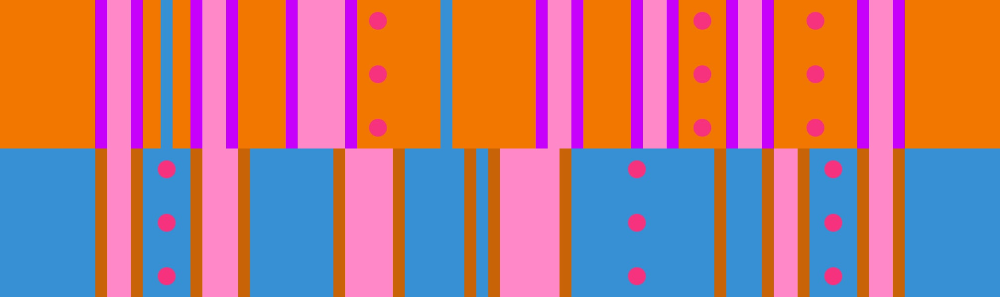

# Easy 4 + Open-Closed

## Overview

Easy 4 + Open-Closed is straightforward up until around the 9th lap when slime reaches maximum level.

## Paths

For laps 1-8, it is easy to start 3 jumps on blue and transfer to orange:

<video controls>
  <source src="../../images/variations/easy-4-open-closed-lap8.mp4" type="video/mp4">
</video>

Beginning with the 9th lap, you'll be forced to start with 4 jumps on orange and transfer to blue:

<video controls>
  <source src="../../images/variations/easy-4-open-closed-lap9.mp4" type="video/mp4">
</video>

## Example Timeouts

View all Roll Off paths for all 20 variations on [YouTube](https://www.youtube.com/playlist?list=PLG_QNSp9ZgJLWYSNl4vY26VJCZeOQHO1F).
