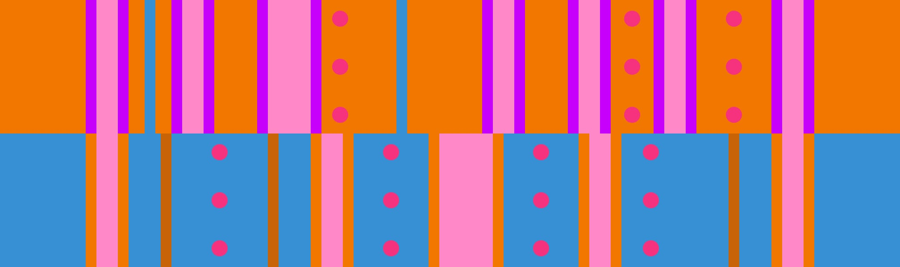

# 橙4 + 蓝多挡板

## 概述

[橙4](../rolls/easy-4.zh.md#橙轮) + [蓝多挡板](../rolls/pillar-trench.zh.md)开头和中间都很简单，橙轮开头可以连续跳4个坑，蓝轮中间可以连续跳3个坑。结尾部分在玩家数量较多时有一定难度，特别是到了后期。

## 路线

第9~12圈结尾处有两种切板方法，我建议你选择玩家数量较少的路线来避免拥挤。

### 结尾从蓝轮切到橙轮

=== "第9圈"

    <video controls>
      <source src="../../images/variations/easy-4-pillar-trench-end-on-orange-lap9.mp4" type="video/mp4">
    </video>

=== "第10圈"

    <video controls>
      <source src="../../images/variations/easy-4-pillar-trench-end-on-orange-lap10.mp4" type="video/mp4">
    </video>

=== "第11圈"

    <video controls>
      <source src="../../images/variations/easy-4-pillar-trench-end-on-orange-lap11.mp4" type="video/mp4">
    </video>

=== "第12圈"

    <video controls>
      <source src="../../images/variations/easy-4-pillar-trench-end-on-orange-lap12.mp4" type="video/mp4">
    </video>

#### 难度

| 圈数 | 难度 |
| ----- | ---------- |
| 9     | 简单       |
| 10    | 简单       |
| 11    | 中等       |
| 12    | 中等       |

### 结尾从橙轮切到蓝轮

=== "第9圈"

    <video controls>
      <source src="../../images/variations/easy-4-pillar-trench-end-on-blue-lap9.mp4" type="video/mp4">
    </video>

=== "第10圈"

    <video controls>
      <source src="../../images/variations/easy-4-pillar-trench-end-on-blue-lap10.mp4" type="video/mp4">
    </video>

=== "第11圈"

    <video controls>
      <source src="../../images/variations/easy-4-pillar-trench-end-on-blue-lap11.mp4" type="video/mp4">
    </video>

=== "第12圈"

    <video controls>
      <source src="../../images/variations/easy-4-pillar-trench-end-on-blue-lap12.mp4" type="video/mp4">
    </video>

#### 难度

| 圈数 | 难度 |
| ----- | ---------- |
| 9     | 中等       |
| 10    | 中等       |
| 11    | 简单       |
| 12    | 简单       |

## 平冠示例

你也可以在Bilibili观看[橙4蓝多的路线展示](https://www.bilibili.com/video/BV1PB4y1i7fh?p=1)。
