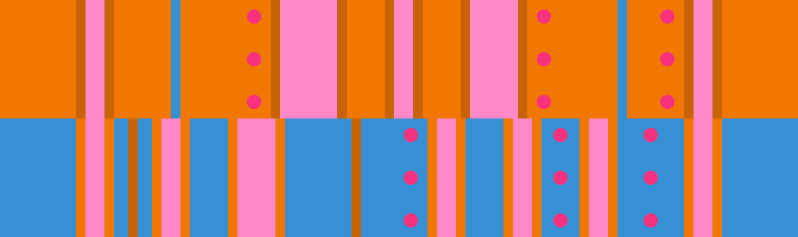

# 橙浮岛 + 蓝4

## 概述

[橙浮岛](../rolls/isolated-duo.zh.md#橙轮) + [蓝4](../rolls/easy-4.zh.md#蓝轮)是一个相对容易的版型，因为蓝板结尾可以连续跳4个坑。后期须从橙轮开始跑，切到蓝轮后再切回橙轮。

## 路线

### 路线示例

=== "第7圈"

    <video controls>
      <source src="../../images/variations/isolated-duo-easy-4-example-path-lap7.mp4" type="video/mp4">
    </video>

=== "第8圈"

    <video controls>
      <source src="../../images/variations/isolated-duo-easy-4-example-path-lap8.mp4" type="video/mp4">
    </video>

=== "第9圈"

    <video controls>
      <source src="../../images/variations/isolated-duo-easy-4-example-path-lap9.mp4" type="video/mp4">
    </video>

=== "第10圈"

    <video controls>
      <source src="../../images/variations/isolated-duo-easy-4-example-path-lap10.mp4" type="video/mp4">
    </video>

=== "第11圈"

    <video controls>
      <source src="../../images/variations/isolated-duo-easy-4-example-path-lap11.mp4" type="video/mp4">
    </video>

=== "第12圈"

    <video controls>
      <source src="../../images/variations/isolated-duo-easy-4-example-path-lap12.mp4" type="video/mp4">
    </video>

## 平冠示例

你也可以在[Bilibili](https://www.bilibili.com/video/BV1PB4y1i7fh)观看全版型路线展示。
