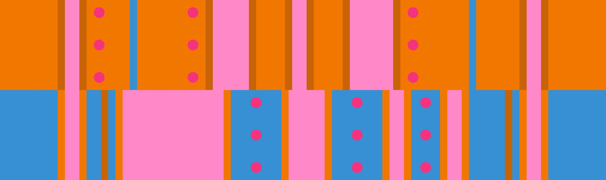

# 고립된 듀오 + 그랜드 캐니언

## 개요

"5번째로 어려운 변형"으로 알려진 [고립된 듀오](../rolls/isolated-duo.md#주황색-롤) + [그랜드 캐니언](../rolls/grand-canyon.md) 변형은 롤 오프 출현하는 모든 변형 중 가장 어려운 변형으로 손꼽힙니다.

## 경로

9번째 랩부터 마지막 12번째 랩까지 4가지 경로를 선택할 수 있습니다.

### 파란색 그랜드 캐니언 패턴에서 시작하는 경로

<video controls>
  <source src="../../images/variations/isolated-duo-grand-canyon-start-on-blue.mp4" type="video/mp4">
</video>

#### 요약

1. [파란색 그랜드 캐니언](../rolls/grand-canyon.md) 패턴에서 시작합니다.
2. [주황색 고립된 듀오](../rolls/isolated-duo.md#주황색-롤) 패턴의 첫 번째 파란 벽이 지나가면 환승합니다.
3. [파란색 그랜드 캐니언](../rolls/grand-canyon.md) 패턴의 바닥이 나타날 때까지 머무르다 바닥이 나타나면 환승합니다.

#### 난이도

| 랩  # | 난이도      |
| ----- | ---------- |
| 9 #   | 쉬움       |
| 10 #  | 중간       |
| 11 #  | 중간       |
| 12 #  | 어려움     |

### 파란색 그랜드 캐니언 모서리를 이용하는 경로

<video controls>
  <source src="../../images/variations/isolated-duo-grand-canyon-gc-ledge.mp4" type="video/mp4">
</video>

#### 요약

1. [주황색 고립된 듀오](../rolls/isolated-duo.md#주황색-롤) 패턴에서 1번의 짧은 점프로 시작합니다.
2. [파란색 그랜드 캐니언](../rolls/grand-canyon.md) 패턴의 금 벽 뒤 좁은 공간으로 환승합니다.
3. [주황색 고립된 듀오](../rolls/isolated-duo.md#주황색-롤) 패턴의 파란 벽이 지나가면 점프해서 환승합니다.
4. [파란색 그랜드 캐니언](../rolls/grand-canyon.md) 패턴의 바닥이 나타날 때까지 머무르다 바닥이 나타나면 환승합니다.

#### 난이도

| 랩  # | 난이도      |
| ----- | ---------- |
| 9 #   | 중간        |
| 10 #  | 중간        |
| 11 #  | 어려움      |
| 12 #  | 어려움      |

### 주황색 고립된 듀오 패턴의 바깥쪽 벽 점프를 이용하는 경로

<video controls>
  <source src="../../images/variations/isolated-duo-grand-canyon-outer-wall-jump.mp4" type="video/mp4">
</video>

#### 요약

1. [주황색 고립된 듀오](../rolls/isolated-duo.md#주황색-롤) 패턴에서 1번의 짧은 점프로 시작합니다.
2. [주황색 고립된 듀오](../rolls/isolated-duo.md#주황색-롤) 패턴의 파란 벽을 벽 점프로 넘어갑니다.
3. 벽 점프로 넘어온 후 패턴을 가로질러서 [파란색 그랜드 캐니언](../rolls/grand-canyon.md) 패턴으로 점프해서 환승합니다.

#### 난이도

| 랩  # | 난이도      |
| ----- | ---------- |
| 9 #   | 중간       |
| 10 #  | 중간       |
| 11 #  | 중간       |
| 12 #  | 중간       |

### 주황색 고립된 듀오 패턴의 안쪽 벽 점프를 이용하는 경로

<video controls>
  <source src="../../images/variations/isolated-duo-grand-canyon-inner-wall-jump.mp4" type="video/mp4">
</video>

#### 요약

1. [주황색 고립된 듀오](../rolls/isolated-duo.md#주황색-롤) 패턴에서 1번의 짧은 점프로 시작합니다.
2. 파란 벽의 안쪽을 벽 점프로 넘어갑니다.
3. [주황색 고립된 듀오](../rolls/isolated-duo.md#주황색-롤) 패턴을 달리다가 [파란색 그랜드 캐니언](../rolls/grand-canyon.md) 패턴이 나타나면 점프해서 환승합니다.

#### 난이도

| 랩  # | 난이도      |
| ----- | ---------- |
| 9 #   | 매우 어려움 |
| 10 #  | 매우 어려움 |
| 11 #  | 어려움      |
| 12 #  | 중간        |

### Rainbow의 경로

<video controls>
  <source src="../../images/variations/isolated-duo-grand-canyon-rainbow-path.mp4" type="video/mp4">
</video>

#### 요약

1. [파란색 그랜드 캐니언](../rolls/grand-canyon.md) 패턴에서 1번의 짧은 점프로 시작합니다.
2. 금 벽의 바깥쪽을 벽 점프로 넘어갑니다.
3. 벽 점프로 넘어온 후 모서리를 가로질러 [주황색 고립된 듀오](../rolls/isolated-duo.md#주황색-롤) 패턴으로 점프 다이브해서 환승합니다.
4. [파란색 그랜드 캐니언](../rolls/grand-canyon.md) 패턴으로 다시 환승합니다.

#### 난이도

| 랩 #  | 난이도      |
| ----- | ---------- |
| 9 #   | 매우 어려움 |
| 10 #  | 매우 어려움 |
| 11 #  | 매우 어려움 |
| 12 #  | 매우 어려움 |

## 권장하는 경로

다음은 이 변형에 대한 이상적인 3인 공동우승의 예시입니다.

* 1명이 9번째 랩에서 마지막 12번째 랩 동안 [파란색 그랜드 캐니언 패턴에서 시작하는 경로](#파란색-그랜드-캐니언-패턴에서-시작하는-경로)를 시도합니다.
* 1명이 9번째 랩에서 마지막 12번째 랩 동안 [파란색 그랜드 캐니언 모서리를 이용하는 경로](#파란색-그랜드-캐니언-모서리를-이용하는-경로)를 시도합니다.
* 1명이 9번째 랩에서 마지막 12번째 랩 동안 [주황색 고립된 듀오 패턴의 바깥쪽 벽 점프를 이용하는 경로](#주황색-고립된-듀오-패턴의-바깥쪽-벽-점프를-이용하는-경로)를 시도합니다.

## 공동우승 예시

롤 오프에서 출현하는 20가지 변형 패턴에 대한 모든 경로를 [유튜브](https://www.youtube.com/playlist?list=PLG_QNSp9ZgJLWYSNl4vY26VJCZeOQHO1F)에서 보실 수 있습니다.
