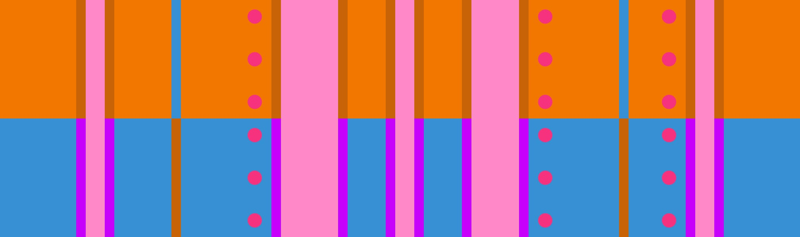

# 橙浮岛 + 蓝浮岛

## 概述

[橙浮岛](../rolls/isolated-duo.zh.md#橙轮) + [蓝浮岛](../rolls/isolated-duo.zh.md#蓝轮)存在一条非常简单的路线，但在玩家数量较多时会变得很难平冠。注意橙轮浮岛后和蓝轮浮岛前的坑均为[大坑](../advanced/isolated-duo-god-jumps.zh.md)，所以没练熟的情况下应尽量避开。如果跳大坑对你来说很轻松，你可以跳大坑来避免拥挤。

## 路线

### 路线示例

=== "第7圈"

    <video controls>
      <source src="../../images/variations/isolated-duo-isolated-duo-example-path-lap7.mp4" type="video/mp4">
    </video>

=== "第8圈"

    <video controls>
      <source src="../../images/variations/isolated-duo-isolated-duo-example-path-lap8.mp4" type="video/mp4">
    </video>

=== "第9圈"

    <video controls>
      <source src="../../images/variations/isolated-duo-isolated-duo-example-path-lap9.mp4" type="video/mp4">
    </video>

=== "第10圈"

    <video controls>
      <source src="../../images/variations/isolated-duo-isolated-duo-example-path-lap10.mp4" type="video/mp4">
    </video>

=== "第11圈"

    <video controls>
      <source src="../../images/variations/isolated-duo-isolated-duo-example-path-lap11.mp4" type="video/mp4">
    </video>

=== "第12圈"

    <video controls>
      <source src="../../images/variations/isolated-duo-isolated-duo-example-path-lap12.mp4" type="video/mp4">
    </video>

## 平冠示例

你也可以在Bilibili观看[橙浮岛蓝浮岛的路线展示](https://www.bilibili.com/video/BV1PB4y1i7fh?p=9)。
