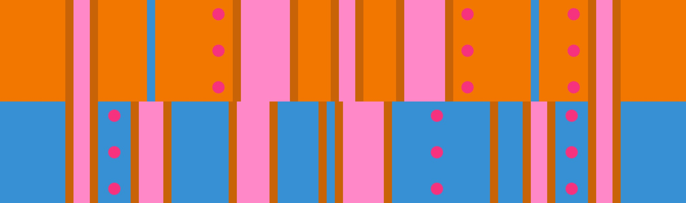

# 고립된 듀오 + 오픈-클로즈드

## 개요

[고립된 듀오](../rolls/isolated-duo.md#주황색-롤) + [오픈-클로즈드](../rolls/closed-open-open-closed.md#파란색-롤) 변형은 랩의 시작 부분에 여유 공간이 많고, 파란색 롤에서 3번 연속 점프 후 주황색 롤의 시작 부분인 열린 공간으로 환승할 수 있습니다. 주황색 롤에서 두 번째 [갓 점프](../advanced/isolated-duo-god-jumps.md)는 연습하지 않았다면 파란색 롤에 머무르는 걸 권장합니다.

## 경로

### 경로 예시

<video controls>
  <source src="../../images/variations/isolated-duo-open-closed-standard-path.mp4" type="video/mp4">
</video>

## 공동우승 예시

롤 오프에서 출현하는 20가지 변형 패턴에 대한 모든 경로를 [유튜브](https://www.youtube.com/playlist?list=PLG_QNSp9ZgJLWYSNl4vY26VJCZeOQHO1F)에서 보실 수 있습니다.
