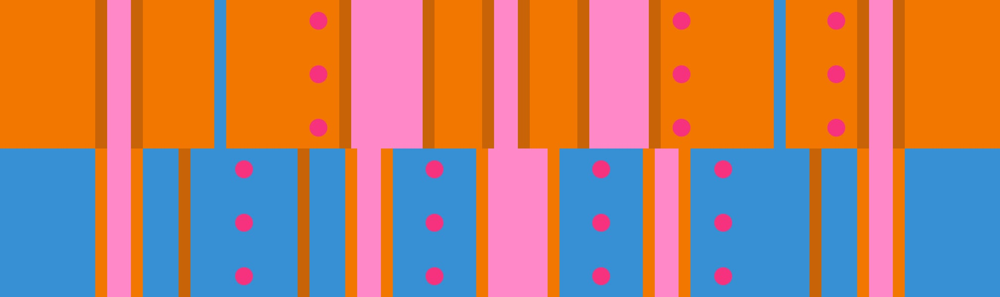

# 고립된 듀오 + 기둥 참호

## 개요

[고립된 듀오](../rolls/isolated-duo.md#주황색-패턴) + [기둥 참호](../rolls/pillar-trench.md#파란색-패턴) 변형은 후반전에서 정해진 경로에 구애받지 않고 유연하게 진행할 수 있습니다. 하지만 [주황색 고립된 듀오](../rolls/isolated-duo.md#주황색-패턴) 패턴의 가운데에 넓은 도랑으로 인해 머무를 수 있는 공간이 적기 때문에 대부분 [파란색 기둥 참호](../rolls/pillar-trench.md#파란색-패턴) 패턴에 머물러야 합니다. [파란색 기둥 참호](../rolls/pillar-trench.md#파란색-패턴) 패턴의 가운데에서 3번의 연속 점프로 진행하거나 두 패턴 사이를 환승하며 경로를 진행할 수 있습니다. 이 변형에서 주의해야 할 점은 두 패턴의 마지막 벽이 작은 간격으로 매우 가깝게 배치될 때 경로를 진행하면서 다른 플레이어의 공간을 확보해 주는 것이 매우 중요합니다.

## 경로

### 경로 예시

=== "7번째 랩"

    <video controls>
      <source src="../../images/variations/isolated-duo-pillar-trench-example-path-lap7.mp4" type="video/mp4">
    </video>

=== "8번째 랩"

    <video controls>
      <source src="../../images/variations/isolated-duo-pillar-trench-example-path-lap8.mp4" type="video/mp4">
    </video>

=== "9번째 랩"

    <video controls>
      <source src="../../images/variations/isolated-duo-pillar-trench-example-path-lap9.mp4" type="video/mp4">
    </video>

=== "10번째 랩"

    <video controls>
      <source src="../../images/variations/isolated-duo-pillar-trench-example-path-lap10.mp4" type="video/mp4">
    </video>

=== "11번째 랩"

    <video controls>
      <source src="../../images/variations/isolated-duo-pillar-trench-example-path-lap11.mp4" type="video/mp4">
    </video>

=== "12번째 랩"

    <video controls>
      <source src="../../images/variations/isolated-duo-pillar-trench-example-path-lap12.mp4" type="video/mp4">
    </video>

## 공동우승 예시

롤 오프에서 출현하는 20가지 변형 패턴에 대한 모든 경로를 [유튜브](https://www.youtube.com/playlist?list=PLG_QNSp9ZgJLWYSNl4vY26VJCZeOQHO1F)에서 보실 수 있습니다.
